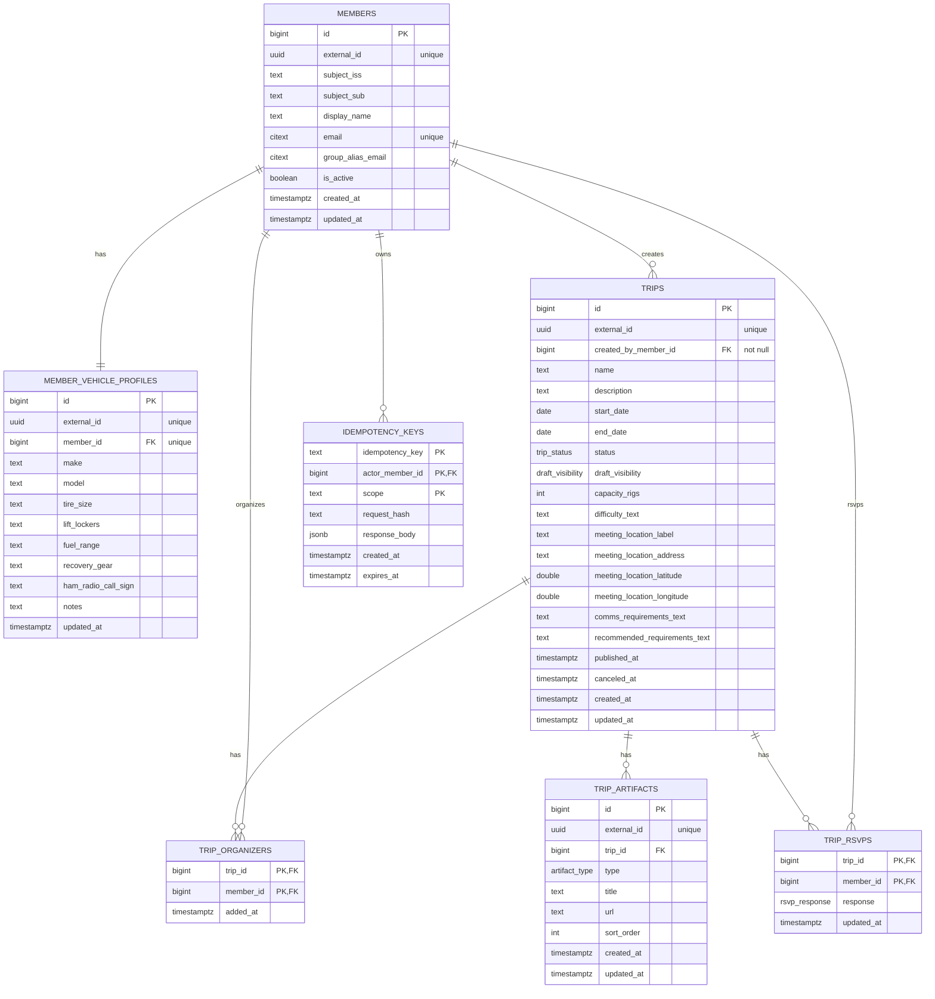

# Database Schema (v1) — Mermaid

Source of truth: `migrations/*.sql`

## Key behaviors enforced in Postgres

- **updated_at automation**: triggers set `updated_at` on `members`, `trips`, `trip_artifacts`, `member_vehicle_profiles`, `trip_rsvps`.
- **Organizer invariant**: trigger blocks deleting the last row in `trip_organizers` for a trip.
- **Trip transitions**: trigger enforces publish requirements + sets `published_at` / `canceled_at`.
- **RSVP capacity + state**: trigger enforces “published-only” and strict capacity on transitions to `YES`.

## Views (read models)

- `v_trip_summary`: trip list fields + `attending_rigs` count.
- `v_trip_rsvp_summary`: `capacity_rigs` + `attending_rigs` count.

